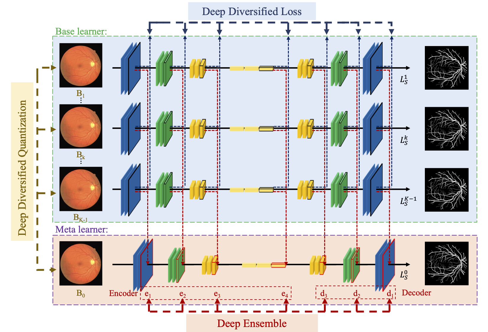

# D2ED2Q: Deep Diversified Ensemble with Deep Diversified Quantization for Efficient Medical Image Segmentation in Internet of Medical Things



**Abstract**:

*Internet of Medical Things (IoMT) is emerging to revolutionize the clinical practice, and medical image segmentation has been one of the most critical tasks in the automatic processing of medical images in IoMT. Recently, deep convolutional neural networks (CNNs) have boosted the performance of medical image segmentation, and ensemble methods are usually further adopted to enhance the performance. However, ensemble methods always incur a substantial increase in computational cost, which is unable to meet the high efficiency standard typically required in IoMT.In this paper, we propose deep diversified ensemble with deep diversified quantization (D2ED2Q) for efficient medical image segmentation in IoMT. First, deep ensemble is used to perform ensemble in a much deeper manner, i.e., an meta learner is employed to fuse the internal features at multiple resolution levels from multiple base learners, which are directly diversified by the proposed deep diversified loss. Then, deep diversified quantization  employs a two-stage partition to eliminate the accuracy loss and increase the randomness of the weights during quantization, which eliminates the notoriously high computational expense of ensemble methods without accuracy loss. We have conducted extensive experiments across four public medical image segmentation datasets, and the experimental results show that our method can effectively improve the segmentation accuracy and outperform the state-of-the-art ensemble methods with reduced computational cost.


## Requirements

The  code requires

- Python 3.6 or higher
- PyTorch 0.4 or higher

and the requirements highlighted in [requirements.txt](./requirements.txt) (for Anaconda)


## Training

To train the CE-Net based D2ED2Q with default setting in the paper on DRIVE dataset, run this command:

```train
python train.py --backbone CE-Net --dataset DRIVE --alpha 0.005 --epoch 1200 -- epochQ 300 --batchsize 4
```


## Evaluation

To evaluate my model on DRIVE dataset, run this command:

```eval
python eval.py --model-path D2ED2Q_DRIVE.pth 
```


